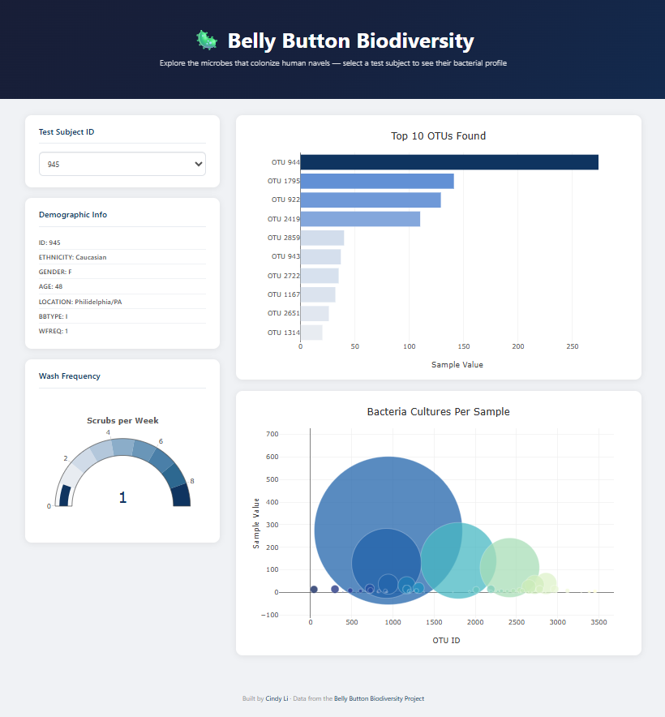

# 🦠 Microbiome Explorer

An interactive web dashboard for exploring bacterial diversity across human samples. Select a test subject to visualize their unique microbial profile — including the most abundant bacterial species, full sample distributions, and hygiene patterns.

🔗 **[Live Demo → microbiome-explorer.netlify.app](https://microbiome-explorer.netlify.app/)**

---

## Features

- **Subject Selector** — Dropdown to browse individual test subject profiles
- **Top 10 OTUs Bar Chart** — Horizontal bar chart showing the 10 most abundant bacterial species (Operational Taxonomic Units) per sample
- **Bubble Chart** — Full sample visualization where bubble size = abundance and color = OTU ID
- **Wash Frequency Gauge** — Gauge chart displaying the subject's weekly belly button washing frequency
- **Demographic Panel** — Displays subject metadata including age, ethnicity, location, and gender

All charts update dynamically on subject selection with smooth Plotly rendering.

---

## Tech Stack

| Layer | Technology |
|---|---|
| **Data Loading** | D3.js |
| **Visualization** | Plotly.js |
| **Layout & Styling** | HTML5, CSS3, Bootstrap |
| **Logic** | Vanilla JavaScript |
| **Hosting** | Netlify (auto-deploys from GitHub) |

---
